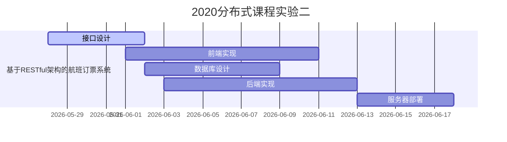
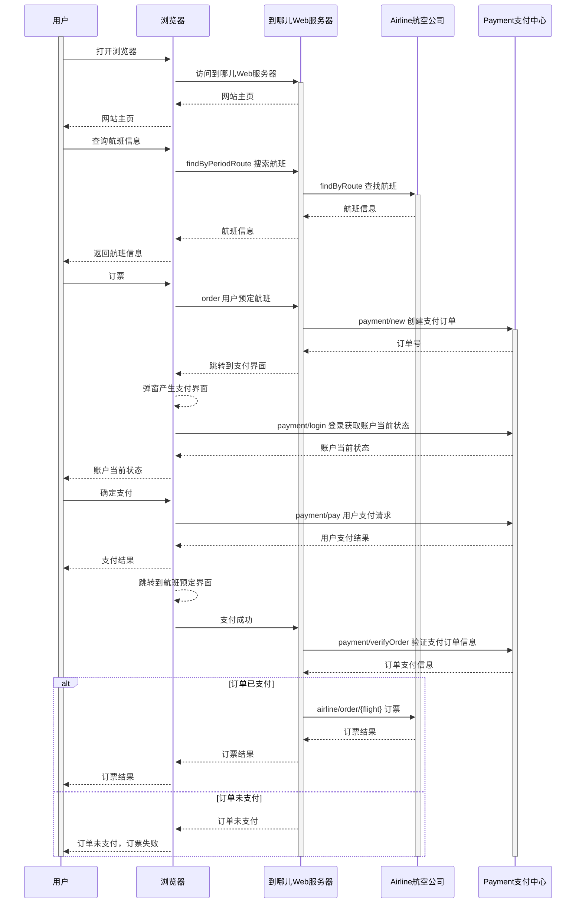

# airlineReservationSystem
2020分布式课程实验，基于RESTful架构的航班订票网站

- 前端实现：JavaScript（要实现Ajax） *ZH负责*
- 后端实现：Java Spring Boot 框架 + restcontroller *ZY负责* 
- 接口设计:  定义主网站、银行、机票商的相关接口 *CFG负责*
- 数据库设计： 包括Bean对象设计、DAO设计 *DLY负责* 
- 服务器部署：负责项目整体部署 *WH负责*

# 项目流程

### 项目进度

- [x] 项目规划、流程设计、接口设计 CFG
- [ ] 数据库、Java Bean与DAO类设计  DLY
- [ ] 前端界面设计与实现 `vue.js` ZH
- [ ] 后端逻辑实现 `Spring Boot` ZY
- [ ] 项目部署 WH

# 项目设计

## 时序图

### 流程图代码

Github不支持mermaid语法，参看下面的图片或复制代码使用**支持mermaid语法的markdown编辑器**查看

### 流程图浏览

## 模块设计

#### API版本

**API 2.0.1 版本**：https://app.swaggerhub.com/apis-docs/homicideGroup/flightReservationSystem/2.0.1       
**API 2.0.0 版本**：https://app.swaggerhub.com/apis-docs/homicideGroup/flightReservationSystem/2.0.0               
**API 1.0.0 版本**：https://app.swaggerhub.com/apis-docs/homicideGroup/flightReservationSystem/1.0.0        

----------------------

#### API更新说明

**2.0.0** 版本更新说明 根据时序图增加了部分API
**2.0.1** 版本更新说明 根据后端程序员要求修改了FindByPeriodRoute的API

-------------------------

**原型设计**：https://fbp2kq.axshare.com
(国内可能访问极其慢)

